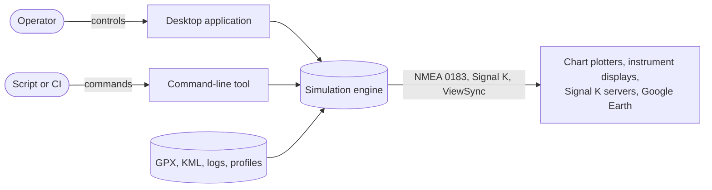
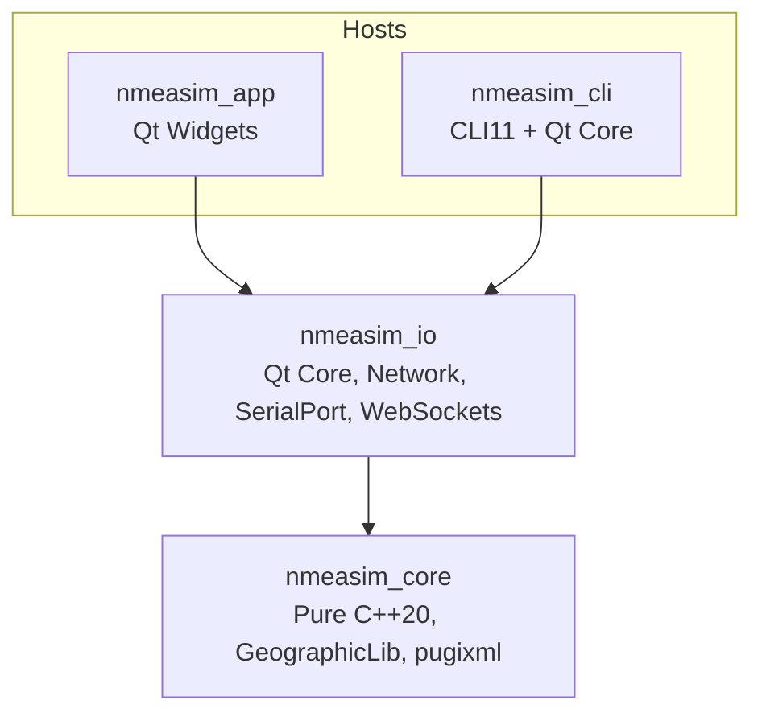
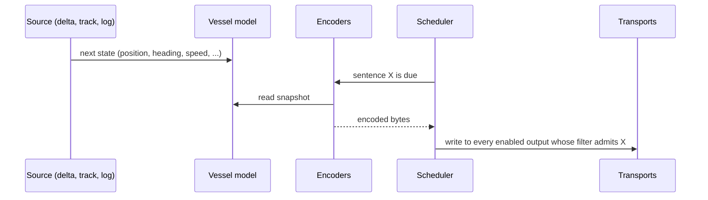

# Architecture

NMEA Simulator X is organised as a small number of layers with strict dependency rules.
The guiding principle is that **the simulation engine must not know how it is hosted**:
the same engine drives the desktop application, the command-line tool and the test suite.

## System context

## Layers

| Layer | Directory | Allowed dependencies | Responsibility |
| --- | --- | --- | --- |
| `nmeasim::core` | `src/core` | Standard library, GeographicLib, pugixml | Vessel model, kinematics, geodesy, sources, route logic, all encoders, GPX/KML/log parsing |
| `nmeasim::io` | `src/io` | `core`, Qt Core, Network, SerialPort, WebSockets | Transports, scheduler, file recording and replay, profile persistence, control bus |
| `nmeasim_cli` | `src/cli` | `core`, `io`, CLI11 | Headless host |
| `nmeasim_app` | `src/app` | `core`, `io`, Qt Widgets | Desktop host: dashboard, settings, console, map |

The rule that matters most: **nothing in `src/core` includes a Qt header.** This keeps the
engine testable with plain Catch2 and portable to any future host.

## Runtime model

The engine runs three independent clocks:

1. **Simulation tick** advances the vessel state. Typical period 100 ms.
2. **Emission schedule** decides when each enabled sentence is encoded and sent. Each
   sentence has its own period, so GGA can go at 10 Hz while ZDA goes at 1 Hz.
3. **Presentation refresh** updates the desktop dashboard and console, decoupled from
   emission so that high output rates never slow the interface.

Inside `nmeasim::io` the `SimulationRunner` owns the transports and a precise Qt timer. Each
timer tick measures the real time elapsed, capped at one second so a suspended host does not
teleport the vessel, steps the simulation by that amount and writes the due sentences to every
open output whose filter admits them. The engine itself never touches timers or sockets, so
the same `Simulation` object is driven identically by the CLI, the desktop application and
the tests.

## Data flow

## Sources

A *source* produces the vessel state for the next tick. Three implementations share one
interface:

- **Delta simulation** applies configured rates of change to seed values, honours manual
  overrides and steering input, and integrates position with the geodesic direct solution.
- **Track follower** walks GPX tracks, GPX routes and KML tracks. With timestamps present the
  speed is derived from them; without timestamps the follower interpolates along each leg at
  the configured speed so the output rate and the point density are independent.
- **Log replay** re-sends a recorded session with pause, step and seek.

## Encoders

Encoders turn a state snapshot into bytes for one protocol: NMEA 0183, Signal K delta JSON,
ViewSync and, later, NMEA 2000 PGNs. The NMEA 0183 encoder is a registry of sentence
builders, each responsible for one formatter, all sharing the framing helpers in
`nmeasim/core/nmea0183/checksum.hpp`. Talker IDs are configurable globally and per sentence.

## Transports

Each output is a transport instance with its own encoder selection and sentence filter.
Several transports can run at once, for example a serial port carrying NMEA 0183 and a
WebSocket server carrying Signal K. Supported transports: serial port, TCP server, TCP client,
UDP unicast, broadcast and multicast with interface selection, WebSocket server, file.

## Control bus (planned)

The intended design is that every action a user can take becomes a command on a control bus:
start, stop, pause, set a value, override a value, steer, load a track. The desktop
application, the CLI's standard input and an optional local HTTP/WebSocket control endpoint
would all speak the same command vocabulary, so that external tools can automate the
simulator. It is not part of 1.0 and is listed on the [roadmap](../development/roadmap.md)
under *After 1.0*: today the desktop application drives the `SimulationRunner` directly, and
the CLI is configured by its arguments and a profile.

## Persistence

Settings are stored as named JSON profiles with a schema version. Every schema change ships
with a migration so that profiles from older versions keep working.

## Extension points

- New sentence: add a builder to the registry, a reference page and a golden-file test.
- New transport: implement the transport interface in `nmeasim::io`.
- New protocol: implement an encoder in `nmeasim::core`.
