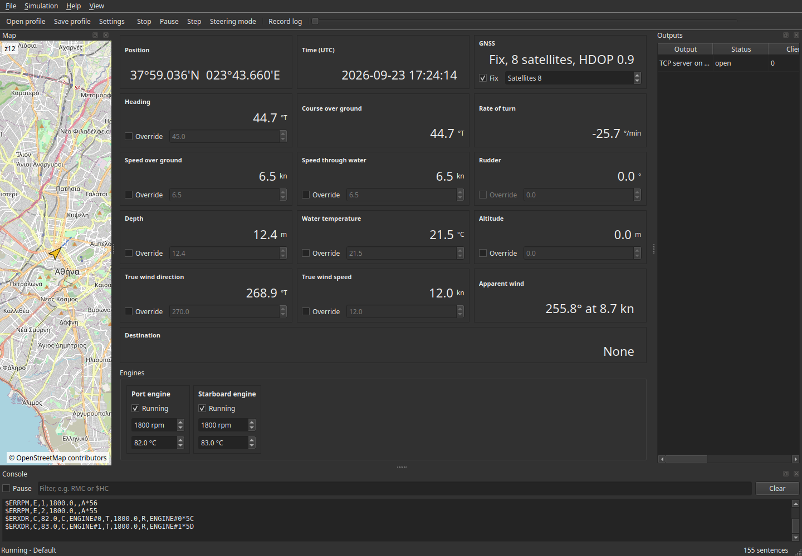
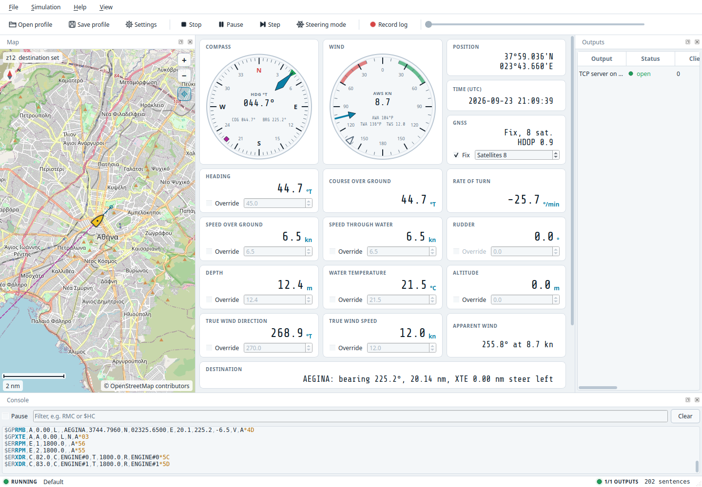

# Desktop application

*NMEA Simulator X* is the Qt Widgets host of the simulation engine. It runs the same
`SimulationRunner` as the [command-line tool](cli.md) and reads and writes the same
[profile files](profile.md).

## Command line

```
NMEASimulatorX [profile.json]
```

When a profile path is given it is loaded at start-up. A profile that cannot be opened, for
example because the path does not exist or its track file is missing, is reported in a
message box, and the last profile used is reopened instead. Without a path the last profile
used is reopened, and if there is none the built-in default profile is used.

## Window layout

| Area | Contents | Can be hidden |
| --- | --- | --- |
| Dashboard (central) | Compass rose and wind dial, then instrument tiles with override controls; scrolls when the window is small | No |
| Map (dock, left) | Vessel, heading, course line and track on a slippy map | Yes, *View* menu |
| Console (dock, bottom) | Sentences as sent, with pause, filter and clear | Yes, *View* menu |
| Outputs (dock, right) | One row per configured output: description, state, clients, lines sent (sentences, or Signal K or ViewSync messages), bytes, last error | Yes, *View* menu |
| Status bar | Indicator lights for the run state (green *RUNNING*, amber *PAUSED*, unlit *STOPPED*) and recording (a blinking red *REC*), then the profile name and mode; on the right the outputs light (*n/m OUTPUTS*: green when all are open, amber while some are opening, red when one failed) and the counter of NMEA 0183 sentences produced. Errors appear here for ten seconds | No |

Docks can be moved to any edge, stacked, floated or closed. Geometry and dock layout are
saved on exit and restored at the next start; the first start gives the map about 400 pixels,
the outputs about 260 and the console about 170.

## Actions and shortcuts

| Menu | Action | Shortcut | Effect |
| --- | --- | --- | --- |
| File | New profile | ++ctrl+n++ | Replaces the current profile with the default one |
| File | Open profile... | ++ctrl+o++ | Loads a JSON profile; the simulation restarts if it was running |
| File | Save profile | ++ctrl+s++ | Writes the current profile to its file, asking for a name the first time |
| File | Save profile as... | ++ctrl+shift+s++ | Writes the current profile to a new file, which becomes the profile's file once written |
| File | Open track... | ++ctrl+t++ | Switches the current profile to track mode with a GPX or KML file; the simulation restarts if it was running |
| File | Open log for replay... | ++ctrl+l++ | Switches the current profile to replay mode with a recorded or plain NMEA log |
| File | Record log... | ++ctrl+r++ | Starts recording every sentence to a log file, or stops the recording when unticked |
| File | Settings... | ++ctrl+comma++ | Opens the [settings dialog](#settings-dialog) for the current profile |
| File | Quit | ++ctrl+q++ | Stops the simulation and closes the window |
| Simulation | Start / Stop | ++f5++ | Opens every enabled output and starts ticking, or closes everything |
| Simulation | Pause | ++f6++ | Freezes the simulated clock and the vessel; outputs stay open |
| Simulation | Step | ++f7++ | Pauses and advances by one tick, or by one recorded sentence during a replay; starts the run paused when it is stopped |
| Simulation | Steering mode | | Arrow keys move the rudder instead of the heading; available in delta mode only, and unticked when a track or log is loaded |
| Simulation | Clear destination | | Stops steering for the waypoint; APB, RMB and XTE are no longer sent |
| Simulation | Start automatically on launch | | Starts the simulation as soon as the window opens |
| View | Map, Console, Outputs | | Shows or hides the panel |
| View | Follow vessel on the map | ++home++ | Keeps the map centred on the vessel; dragging the map switches it off |
| View | Download map tiles | | Fetches missing tiles from the tile server; off uses the disk cache only |
| View | Clear map tile cache | | Deletes every cached tile from disk and memory |
| View | Theme | | *Follow the system*, *Night bridge (dark)* (the default) or *Daylight (light)*; see [Appearance](#appearance) |
| Help | About | | Version and project link; development builds add the `git describe` string of their commit, as `nmeasim --version` does |

On macOS the ++ctrl++ shortcuts use ++cmd++.

## Transport controls

The toolbar ends with a seek slider and a position label. Both are active while the profile
follows a track or replays a log, whose length is known, and disabled for the delta
simulation, which is endless.

| Control | Effect |
| --- | --- |
| *Pause* | Stops the clock; the outputs stay open |
| *Step* | One tick of the simulation (the profile's simulation step), or exactly the next recorded sentence during a replay |
| Slider | Drag or click to move to that point of the track or log. The vessel state and the map change at once; during a replay the sentences before the new position are applied to the state without being sent |
| Label | Elapsed and total time as `mm:ss` or `h:mm:ss` |

A track or log that is not set to loop ends the run by itself: the last sentence is sent,
the status bar reports *End of the track or log reached* and the outputs close.

## Modes

The [profile](profile.md#simulation) decides what drives the vessel:

| Mode | Vessel | Dashboard | Map |
| --- | --- | --- | --- |
| Delta simulation | Seed values that drift, with overrides and steering | Overrides active | Vessel and sailed track |
| Follow a track | A [GPX or KML file](track-files.md) | Overrides disabled | The loaded track is drawn in green under the sailed track |
| Replay a log | The sentences of a [log file](log-format.md), decoded into the state | Overrides disabled | Vessel and sailed track from the decoded positions |

Use *File → Open track...* or *Open log for replay...* to switch the current profile to
those modes with one file, or the *Mode* group of the settings dialog to set every option.
*File → New profile* or the settings dialog return to the delta simulation.

## Recording

*File → Record log...* asks for a file and records every emitted sentence, whatever the
profile outputs and their filters, in the [log format](log-format.md). The file is truncated
when the recording starts and continued across *Stop* and *Start* until the action is
unticked. The status bar and the action's tooltip show the file being written. To record only
some sentences, add a *Log* output with a filter in the settings dialog instead.

## Keyboard control of the vessel

The main window must have focus; click on the dashboard if the arrow keys do not respond.

| Key | Parameter | Step | With ++shift++ |
| --- | --- | --- | --- |
| ++up++ / ++down++ | Speed over ground | 0.1 kn | 1 kn |
| ++left++ / ++right++ | Heading (steering mode off) | 1° | 10° |
| ++left++ / ++right++ | Rudder angle (steering mode on) | 1° | 10° |

A nudge sets an override on the parameter, which pins it at the new value until the override
is cleared from the tile.
In track and replay mode the file drives the vessel, so the arrow keys nudge nothing and are
left to the rest of the window.

## Dashboard instruments

The top row holds two round instruments and the position, time and GNSS tiles:

| Instrument | Shows |
| --- | --- |
| Compass | North-up rose with 5° ticks. The heading is the cyan pointer, the course over ground a green triangle on the ring and, with a destination, the bearing to it a magenta diamond. The centre reads *HDG*, and below it *COG* and *BRG* |
| Wind | Angles relative to the bow, with the close-hauled sectors (20° to 60°) red to port and green to starboard. The apparent wind is the cyan arrow, the true wind the hollow triangle. The centre reads the apparent wind speed (*AWS*), the apparent wind angle (*AWA*), the true wind angle (*TWA*) and speed (*TWS*); angles are written as sailors say them, `104°P` to port, `30°S` to starboard |

## Dashboard tiles

| Tile | Shows | Override |
| --- | --- | --- |
| Position | Latitude and longitude in degrees and decimal minutes, on two lines | No |
| Time (UTC) | Simulated clock | No |
| GNSS | Fix state, satellites in use, HDOP | *Fix* check box, *Satellites* spin box (0 to 12) |
| Heading | True heading | Yes, 0 to 359.9°; disabled in steering mode |
| Course over ground | Derived from heading and drift | No |
| Rate of turn | Degrees per minute | No |
| Speed over ground | kn | Yes |
| Speed through water | kn | Yes |
| Rudder | Rudder angle | Yes, -45 to 45°; enabled only in steering mode |
| Depth | Below transducer, m | Yes |
| Water temperature | °C | Yes |
| Altitude | m | Yes |
| True wind direction | Degrees true | Yes |
| True wind speed | kn | Yes |
| Apparent wind | Angle and speed derived from true wind and vessel motion | No |
| Destination | Waypoint id, bearing and distance to it, cross-track error and the side to steer; *None* without a destination | No, set it on the map |
| Engines | One tile per configured engine with its label, a *Running* switch, revolutions and coolant temperature | Yes, every field; changes apply at once to RPM, XDR, the AIS and Signal K output |

An active override stops the random drift of that parameter, and the tile gets an amber
border so that overridden values stand out. Clearing it lets the value drift again from where
it is: a value pinned outside the seed plus or minus the amplitude drifts back towards that
band at its normal step rate, one full step per tick, and then wanders within it. In steering
mode the heading follows the rudder even when its override is set; switching steering off
leaves the override holding the heading where the rudder left it. In track and replay mode every override control is disabled,
because the file drives the vessel.

## Map

The map shows the vessel as a yellow hull pointing along its true heading, with a thin
heading line ahead of the bow and a dashed course vector along the course over ground that
ends, with a small circle, where the vessel will be in six minutes at its speed over ground.
The positions sailed since the profile was applied form a red track (at most 5000 points).
In track mode the loaded track or route is drawn in green underneath, with a marker on every
point when it has 500 points or fewer.

Overlays keep the chart readable:

| Where | Overlay |
| --- | --- |
| Top left | Zoom level (with one decimal between whole levels) and *offline*, *free view* or *destination set*; below it a north arrow, as the chart is always north up |
| Top right | Buttons *+* and *−* (zoom one level) and *Follow the vessel* (lit while following) |
| Bottom left | Scale bar in round nautical miles (0.1 to 5000 nm), or metres below 0.1 nm |
| Bottom right | The position under the pointer while it is over the map, and the attribution of the tile server |

The zoom level is continuous: the wheel, the touchpad and pinch gestures zoom smoothly, using
the tiles of the nearest whole level scaled to fit, while the keys and buttons step to whole
levels. The map pans freely across the 180th meridian: the world repeats east and west, and
positions picked on the map always have a longitude between -180° and 180°.

| Input | Effect |
| --- | --- |
| Drag with the left button | Pans the map and switches *Follow vessel* off |
| Mouse wheel or two-finger touchpad scroll | Zooms smoothly around the pointer, or around the vessel while *Follow vessel* is on; one wheel notch is one level |
| Pinch on a touchpad | Zooms smoothly around the fingers, where the platform reports pinch gestures (macOS, Wayland) |
| *+* / *−* buttons | Zoom in or out one level around the centre |
| ++plus++ / ++minus++ | Zooms in or out around the centre |
| ++home++, or the *Follow the vessel* button | Switches *Follow vessel* on and recentres |
| Double-click, or ++ctrl++ and click | Moves the vessel to that point |
| ++shift++ and click | Sets the destination waypoint at that point; the leg starts where the vessel is |
| Right click | Menu with *Move vessel here*, *Set destination here* and *Clear destination* |

Moving the vessel changes the running simulation immediately and also the start position of
the current profile, so saving the profile keeps the new place. The sailed track starts a new
segment at the new place instead of drawing a line from the old one, and a destination's leg
restarts there as well. Seeking in a track or log also starts a new segment. The destination is drawn as a
magenta diamond with a dashed bearing line from the vessel and a dotted line for the leg from
its origin; the words *destination set* appear in the corner. Setting or clearing it changes
the running simulation and the profile seed at once; the waypoint id is `WPT` until it is
renamed on the *Simulation* tab of the settings dialog. See
[Set a destination](../how-to/set-a-destination.md).

### Tiles

Tiles follow the slippy map scheme and come from a tile server given as a URL template
with `{z}`, `{x}` and `{y}` placeholders. The default is the OpenStreetMap server,
`https://tile.openstreetmap.org/{z}/{x}/{y}.png`, used under its
[tile usage policy](https://operations.osmfoundation.org/policies/tiles/): requests carry
a `User-Agent` naming this application and its version, at most four downloads run at a time,
every tile is cached and a tile that failed is not requested over and over. Set another server
through the `map/tile_url` preference.

A tile the server does not have (HTTP 404 or 410) is not requested again until the
application restarts. After any other failure, such as no network
connection, a timeout or another HTTP error, the tile is requested again at the earliest 30
seconds later, and each further failure of the same tile doubles that delay up to 10 minutes.
Unticking and ticking *View → Download map tiles* again retries those tiles at once.

The map credits *© OpenStreetMap contributors* in its bottom-right corner when the tiles come
from an OpenStreetMap server (a host ending in `openstreetmap.org`). For any other server it
draws no attribution, because it cannot know that server's terms: put the credit the server
asks for in the `map/tile_attribution` preference, which replaces the default for every
server (an empty value draws none).

Every downloaded tile is written to the tile cache directory below, so once an area has
been viewed it stays available without a network connection. When a tile is missing the map
shows the matching part of the nearest cached lower zoom level, or a grey square when there
is none. Untick *View → Download map tiles* to stop all network access; the map then uses
the cache only and shows *offline*. Unticking it also cancels the downloads in progress, as does
*View → Clear map tile cache*.

| Platform | Tile cache directory |
| --- | --- |
| Windows | `%LOCALAPPDATA%\NMEASimulatorX\NMEASimulatorX\cache\tiles` |
| macOS | `~/Library/Caches/NMEASimulatorX/NMEASimulatorX/tiles` |
| Linux | `~/.cache/NMEASimulatorX/NMEASimulatorX/tiles` |

The `map/cache_directory` preference moves the cache: the tiles are then kept in its `tiles`
sub-directory, which *Clear map tile cache* deletes, and the change takes effect at the next
start.

## Console

The console buffers sentences and repaints a few times per second so that high output rates
do not slow the interface. It keeps the last 2000 lines. The filter matches the registry id
(for example `RMC`) or any part of the sentence text (for example `$HC`), case-insensitively,
and applies to new sentences only. *Pause* stops new sentences from being added without
affecting the simulation.

Lines are coloured like a protocol analyser: the talker (`$GP`, `!AI`), the sentence
formatter (`RMC`, in bold), the field separators, the checksum and an IEC 61162-450 TAG block
each have their own colour, and Signal K and other JSON messages are shown in one colour.

## Outputs

The table refreshes twice a second and whenever an output changes state. The state column
uses the names listed in the [transport reference](transports.md), with a coloured light:
green *open*, amber *opening*, red *failed*, grey *closed*. An output that fails to
open is reported in the status bar and in the *Last error* column while the run continues on
the other outputs.

## Appearance





*View → Theme* switches between two looks at once, and the choice is kept:

| Theme | Look |
| --- | --- |
| Night bridge (dark), the default | Charcoal and navy panels with cyan accents, as on a ship's bridge at night; map tiles are darkened so that they do not dazzle |
| Daylight (light) | White and light grey panels with teal accents and normal map colours, for bright rooms |
| Follow the system | Night or daylight after the desktop's dark or light setting, switching when the desktop does |

Instrument readouts use the Share Tech Mono typeface by Carrois Type Design, bundled with the
application under the SIL Open Font License 1.1 (installed as `ShareTechMono-OFL.txt` next to
the licence of the application). Toolbar icons are drawn by the application and follow the
theme.

## Settings dialog

*File → Settings...* edits a copy of the current profile in four tabs. *OK* applies the
result as the current profile, restarting the simulation if it was running; *Cancel* discards
every change. The profile on disk is not touched until you save it.

### Simulation tab

| Group | Fields |
| --- | --- |
| Mode | *Vessel driven by*: delta simulation, follow a track or replay a log |
| Track | File (with *Browse...*), speed without timestamps, follow the track's own timestamps, start again at the end; enabled in track mode |
| Log replay | File (with *Browse...*), interval without times, start again at the end; enabled in replay mode |
| Profile and clock | Name, simulation step (10 to 10000 ms), fixed start time in UTC or the wall clock, random seed (0 to 4294967295) |
| Initial vessel values | Latitude, longitude, altitude, heading, speed over ground, magnetic variation and deviation, depth, transducer offset, water temperature, true wind direction and speed |
| GNSS receiver | Fix, fix quality, satellites in use and in view, HDOP, PDOP, VDOP, geoid separation |
| Drift around the initial values | Amplitude and step per second for heading, speed, depth, water temperature, wind direction and wind speed; an amplitude of 0 freezes the value; enabled in delta mode |
| Destination | *Steer for a waypoint*, its id, latitude, longitude and arrival circle radius; a new destination starts its leg at the initial position, and one whose coordinates were not edited keeps its leg |
| Steering | Turn rate per degree of rudder, maximum rudder angle |

The fields map one to one onto the `simulation` object of the
[profile file](profile.md#simulation). Latitudes and longitudes are shown with six decimals;
a coordinate whose field is left unchanged keeps all the decimals it has in the profile.

### Vessel tab

| Group | Fields |
| --- | --- |
| Engines | A table with one row per engine: label, running, revolutions, coolant temperature; *Add engine* and *Remove*. The first row is engine 1 in RPM and `ENGINE#0` in XDR; the Signal K id comes from the label. |
| AIS static data | MMSI, IMO number, vessel name, call sign, ship type code, antenna distances to bow, stern, port and starboard, draught, voyage destination, navigational status, position report type; see the [AIS reference](ais.md) |

### Sentences tab

One row per sentence in the registry with its enabled flag, id, description, group, talker
and period in milliseconds. A talker is two letters; an empty talker uses the registry default
shown as placeholder, and *OK* refuses a single letter. *Enable all*, *Disable all* and
*Reset to defaults* act on every row, and leave *Position decimals* alone, which sets the
fractional minute digits of latitude and longitude.

Only rows that differ from the registry defaults are written to the profile, so a saved
profile stays small and follows registry changes in later versions.

Below the registry, the *Custom sentences* table holds the operator's own sentences
([reference](nmea0183-sentences.md#custom-sentences)): an enabled flag, an id (empty gives
`CUSTOM-n`, where `n` is the row number shown as placeholder), the sentence without checksum
and its period. *OK* refuses a body that cannot be framed, an id that belongs to a registry
sentence and an id used by two rows, naming the rows.

### Outputs tab

The list on the left holds the outputs in the order they are opened. *Add* offers every
transport type, including *Log (timestamped)* for a filtered recording; *Remove* deletes the selected output. The editor on the right shows the
common fields, *Enabled*, the comma-separated *Sentence filter*, the *Encoding* and the
*Period*, above the fields of the selected type as listed in the
[transport reference](transports.md). Serial ports found on the machine are offered in the
port list, and any other device path can be typed.

The encoding decides what the output carries and which option group appears below the type
fields ([profile reference](profile.md#outputs)):

| Encoding | Filter | Option group |
| --- | --- | --- |
| NMEA 0183 sentences | Registry and custom sentence ids | *IEC 61162-450 TAG block*: enable, source, include the time, time in milliseconds |
| Signal K deltas | Path prefixes such as `navigation` | *Signal K*: context (vessel with the AIS MMSI, aircraft, or a custom string) and source label; *Period* sets the delta rate |
| ViewSync packets | not used | *ViewSync camera*: height above the vessel, tilt, roll, planet; *Period* sets the packet rate |

*OK* is refused, with the reason shown under the tabs, while the track or replay mode has no
file, a serial output has no port or baud rate, a file or log output has no path or a TCP
client has no host, a registry sentence has a one-letter talker, or two custom sentences
share an id.

## Preferences

Application preferences are separate from profiles and are stored with `QSettings` in the
platform's native location:

| Platform | Location |
| --- | --- |
| Windows | Registry key `HKEY_CURRENT_USER\Software\NMEASimulatorX\NMEASimulatorX` |
| macOS | `~/Library/Preferences/io.github.dimitrios-kafetzis.NMEASimulatorX.plist` |
| Linux | `~/.config/NMEASimulatorX/NMEASimulatorX.conf` |

| Key | Meaning |
| --- | --- |
| `profile/last_path` | Profile reopened at the next start |
| `window/geometry`, `window/state` | Window size, position and dock layout |
| `simulation/autostart` | Whether the simulation starts on launch |
| `map/online` | Whether missing tiles are downloaded (default `true`) |
| `map/tile_url` | Tile URL template; empty uses the OpenStreetMap server |
| `map/tile_attribution` | Attribution drawn on the map; unset credits OpenStreetMap for its own servers only |
| `map/zoom` | Last map zoom level, fractional |
| `map/cache_directory` | Directory whose `tiles` sub-directory holds the tile cache; empty uses the platform's cache directory above |
| `appearance/theme` | `night` (default), `day` or `system` |

The default folder offered by the profile dialogs is the `profiles` sub-folder of the
application's configuration directory.
